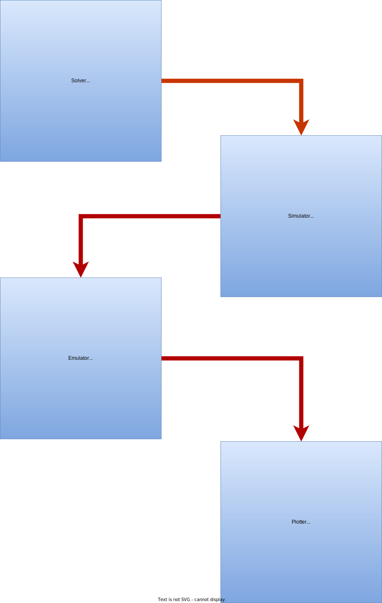

# Emulode: Emulating Ordinary Differential Equations

## Structure of the workfow

There are four fundamental components for the workflow of the code. These are implemented as four high level classes.

