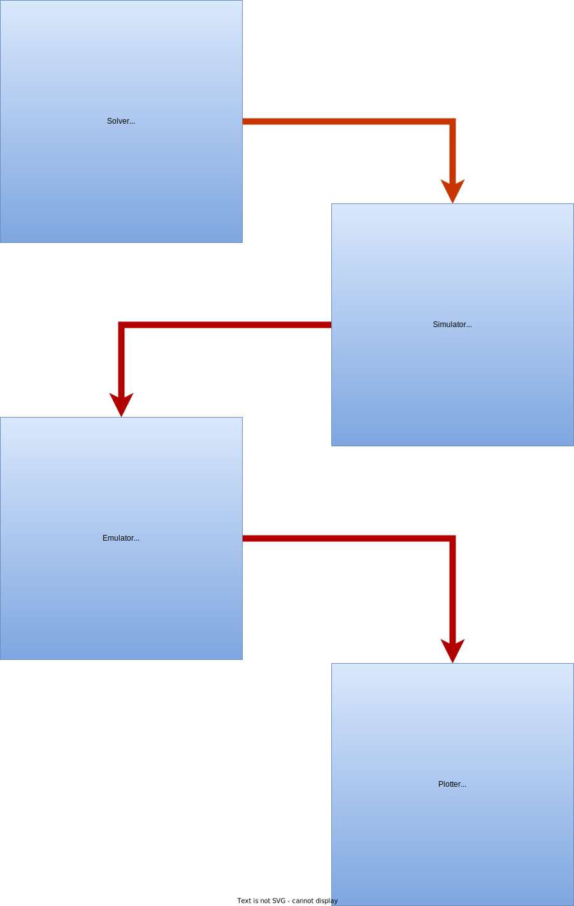

# Emulode: Emulating Ordinary Differential Equations

This python tools provides a clean and easily customisable interface to emulate simulations involving systems of differential equations. This is essentially a wrapper of the [DGP Package](https://github.com/mingdeyu/DGP) which, in turn provides tools such as **Deep Gaussian Process Emulators** and **Linked Gaussian Process Emulators**.

> **Note**: This work is currently under active development

We divide the entire emulation process into the following four distinct steps.

